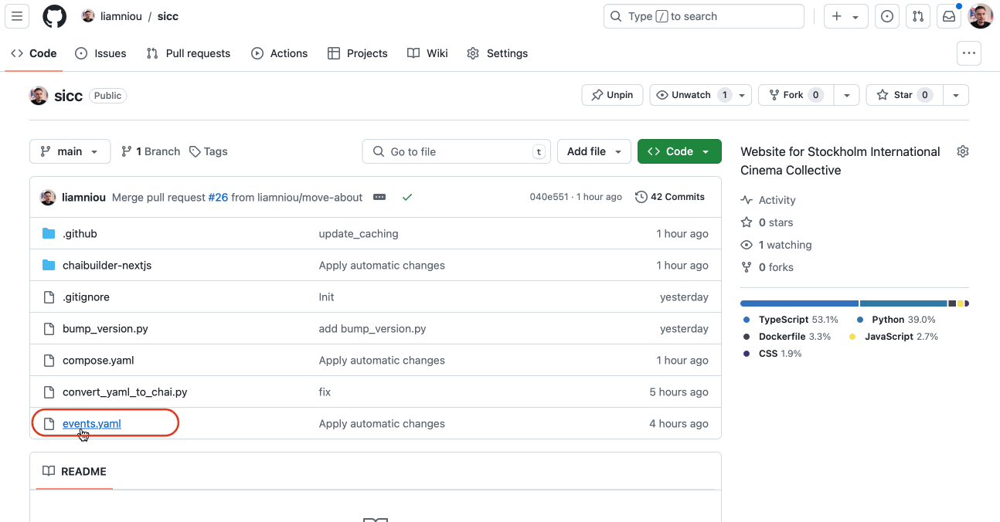

# Website for SICC

## How to add new event
1. Open `events.yaml`, click `Edit this file`
2. Add new entry (date, https://www.themoviedb.org URL of the movie, place):
```
- date: Nov 14 2024
  moviedb: https://www.themoviedb.org/movie/some_moviedb_url
  place: Bio Name
```
**Date should be in format Jan (3 letters month name) 01 2024**

3. Commit changes
4. Choose `Create a new branch for this commit and start a pull request`
5. Propose changes
6. Create pull request

